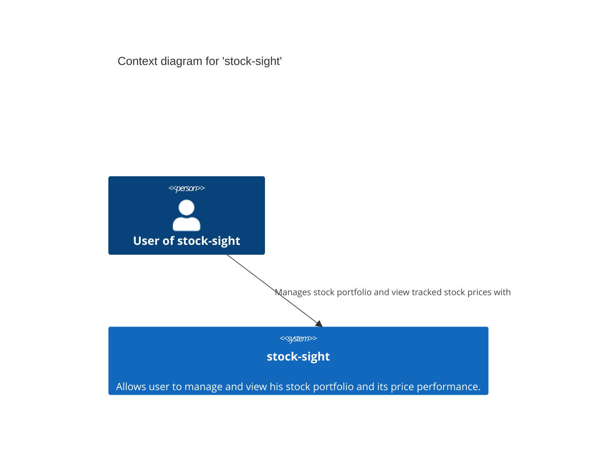
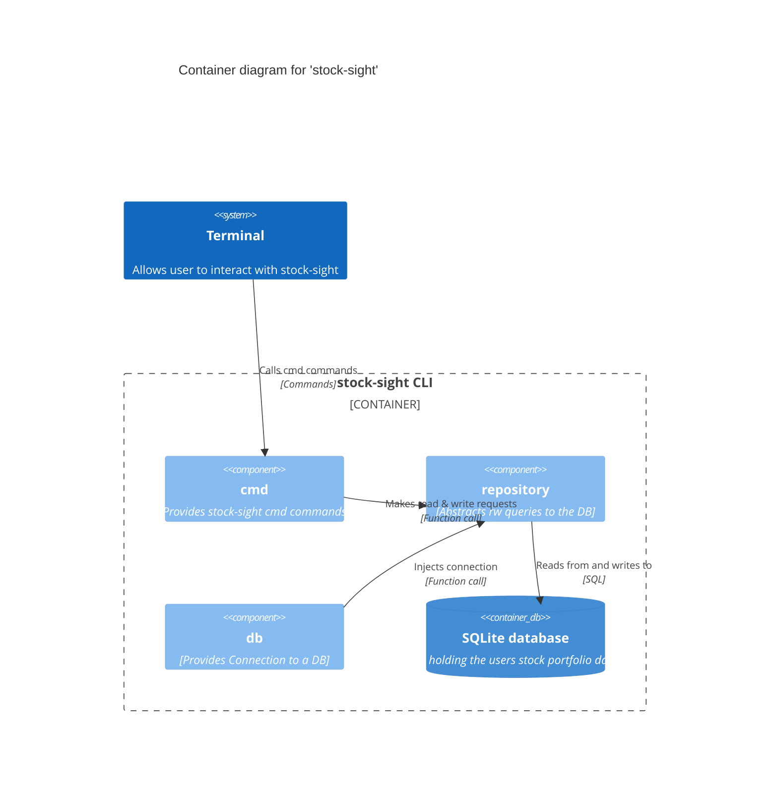

# stock-sight Architecture

This documentation provides architectural information about the architectural structure of [stock-sight](https://github.com/ruegerj/stock-sight). The chapter structure is derived from [arc42](https://arc42.org/overview). No demands on completness.

# 1. Introduction & Goals

Stock-sight is a terminal based stock watcher & tracker.
This project was conducted as part of the HSLU SWAT lectures in FS25.

The main goals of this project include:

-   Tracking stock prices.
-   Tracking portfolio performance on owned stocks.
-   Applying Techniques & Concepts learned in SWAT lectures on a real project.

## 1.1 Requirements Overview

_What is stock-sight?_
Stock-sight is a terminal based application, which allows it's user to track stocks and create there own portfolio containing the stock buys & sells. In addition this project is used as a learning ground for concepts & techniques learned in the SWAT lectures @ HSLU.

## 1.2 Main (planned) features

To gasp the extend of the project, a analysis of the functional aswell as non-functional requirements was conducted, leading to the following requirements:

1. I want to select stocks either traded on _bxswiss_ and or _Six_
2. I can choose some of the selectable stocks in order to track their price development from this point forward.
3. I can track the point of time when I sold/bought a concrete amount of stocks and their current value at this time.
4. I can visualize the price history of a tracked stock over the time periods: day, week, month & year.
5. I can visualize the buying/selling points of my stocks within the price chart.
6. I can visualize my current stock portfolio, based on the buys/sells previously registered in the app.

(A detailed overview aswell as the user stories resulting from this requirements can be found under [requirements.md](requirements.md))

## 1.3 Quality features

On the non-functional (Quality) side, the following requirements where engineered:

1. The app should start in under 5sec.
2. The app should run on Linux (AMD64) / Windows (AMD64) / Mac (ARM64)
3. The app is designed in an extensible way in order to facilitate adapting new marketplaces & item types.
4. The app and its datastore is portable and can be moved to another device.
5. The app's data is encrypted at rest (Optional).
6. The app should display the portfolio (based on latest data points) and price-history of the tracked stocks offline.

(A detailed overview of the constraints can be found under [requirements.ms](requirements.md))

## 1.4 Stakeholders

The following table contains the most important stakeholder for this application.

| Stakeholder         | Motivation                                                                                         |
| ------------------- | -------------------------------------------------------------------------------------------------- |
| Developers          | Learn new technologies and apply newly learned techniques an concepts.                             |
| Users               | Easily track stocks and portfolios through a terminal based solution locally on there device.      |
| Software Architects | Learn and apply common concepts of software architecture, design a reliable and extensable system. |

# 3. Context & Scope

This chapter describes the environment and context stock-sight is embedded into.

## 3.1 Business Context

This diagram shows the interaction between the environment with the stock-sight system. It can also be found under [diagrams/c4](diagrams/c4.md)

**stock-sight User**

A stock-sight users interacts with the application via terminal. He uses stock-sight to add desired stock to a watchlist, track there performance aswell as recording stock buy and sells he made.

**stock-sight**

The main application is responsible for displaying stock prices to the user, aswell as keeping track and persistence of the stock buys and sells he entered into the application.

# 5. Building Block View

Stock-sight is composed out of multiple components which together emerge to a full application. In the following the most important component of stock-sight are described in more detail.

(This diagram can also be found under [diagrams/c4](diagrams/c4.md))

**cmd**

The _cmd_ component provides all commands stock-sight currently implements. It handles the direct interaction with the user.

**repository**

Provides a abstraction for data access and the underlying database implementation.

**db**

Handles the connection to the underlying SQLite database.

**SQLite database**

Reponsible for persisting stock aswell as buy and sell information entered by the user.

# 8. Crosscutting Concepts

> tbd

# 9. Architectural Decisions

In designing the systems multiple architectural decisions where made, which are documentet via *A*rchitectual *D*ecision *R*ecords.
A overview of the currently still relevant ADRs which are implemented in the current version of the Software are given below.
All architectural decisions made in the lifespan of the application can also be found under [decisions](decisions/decisions.md)

## 9.1 SQLite as Database for perisistence

**Status:** Proposed

## Context and Problem Statement

For stock-sight various data like stock-buys / -sells, tracked stocks etc. are entered by the user. This data should be persisted in
order to be accessible in the future (you want to know what stocks you bought and when). According to a [non-functional requirement
nr. 4](https://github.com/ruegerj/stock-sight/blob/main/docs/requirements.md#requirements) a _portable_ datastore is demanded.

## Considered Options

1. [MongoDB](https://www.mongodb.com/)
2. [PostgreSQL](https://www.postgresql.org/)
3. [SQLite](https://www.sqlite.org/)

## Decision Outcome

Chosen option: "SQLite", since it is the only database that is truly portable without any caveats (thus supporting the
non-functional requirement mentioned above). In addition a local installation of the other options would be possible, however it
would lead to both installation complexity and performance overhead on the users machine.

### Consequences

-   Good, because it is just a single file at rest and thus truly portable.
-   Good, because it doesn't add any performance overhead on the users machine.
-   Potentially Bad, because the scalability could become a theoretical issue with a huge amount of data. However in practice this is
    neglectful, since projects like [PocketBase](https://pocketbase.io/) prove the immense load capabilities of SQLite, which aren't
    expected to be exceeded in the projects scope.

## 9.2 SQLC as ORM for accessing data

**Status:** Proposed

## Context and Problem Statement

When interacting with a database writing everything from hand (connection, queries, models etc.) is rarely a good idea. Object-
Relational-Mappers (ORM's) help to abstract some of these parts in order to improve productivity, reliability, security and other
aspects.

## Considered Options

1. [GORM](https://gorm.io/index.html)
2. [SQLC](https://sqlc.dev/)

## Decision Outcome

Chosen option: "SQLC", since it ensures compatibility and type-safety between queries and db-schema at the same time. Additionally
it allows/demands one to write all queries from hand in order to optimize for the schema at hand and fine tune them if necessary.

### Consequences

-   Good, because it aligns db-schema and queries in order to prevent a discrepancy between them causing errors during runtime.
-   Good, because it forces one to write their own queries, allowing for customization and fine-tuning.
-   Good, because it consists of minimal abstractions, making the tool easily understandable for newcomers.
-   Bad, because it forces one to write their own queries, slowing down the development speed and increasing the initial building cost.
-   Potentially bad, because it lacks some quality of life features compared to GORM. However these wont be needed for the current
    scope of the project.

## 9.3 Dependency Injection in combination with an IoC Container

**Status:** Proposed

## Context and Problem Statement

Most a bit more complex applications have components coupled to others, for instance: _a service needs an instance of a repository in
order to access data stored in the database_. Depending where the repository is instantiated the coupling is lighter or tighter
(outside vs. inside the service). Additionally it has a direct impact how testable a component is e.g. how easily some mocks/fakes
can be provided for isolating the scope of tests.

## Considered Options

-   Dependency Injection as principle on its own
-   Dependency Injection with an IoC (Inversion of Control) container
-   none of them

## Decision Outcome

Chosen option: "Dependency Injection with an IoC container", since the benefits of dependency injection principles (testability,
interchangeability & lighter coupling) lie at hand. When combined with an IoC container the ergonomics of automatically provisioning
the correct dependencies for each component and the other features outweigh the initial setup efforts.

[fx](https://github.com/uber-go/fx) by Uber was chosen as an IoC container since it is "battle tested" on Uber's production services
and provides some nice features like lifecycle hooks for controlling the application startup/shutdown.

### Consequences

-   Good, because it implicitly enforces testable code-design
-   Good, because it provides interchangeability of components and lighter coupling between them
-   Good, because it automatically provisions the necessary dependencies for each component instance
-   Bad, because it requires some additional boiler plate and initial setup efforts, however the return of investment should be quite
    fast.

## 9.4 Repository Pattern as data-access abstraction

**Status:** Proposed

## Context and Problem Statement

Data-access logic (e.g. queries) can easily pollute the domain code of an application as it grows and gets complexer. This leads to
deteriorated readability of the _actual_ business logic, making the code harder to maintain. In addition the coupling to the used
persistence technology is omnipresent, causing for big refactoring costs, should it be exchanged in the future.

## Considered Options

-   [Repository Pattern](https://martinfowler.com/eaaCatalog/repository.html)
-   no abstraction for data-access

## Decision Outcome

Chosen option: "Repository Pattern", because it provides a neat and lightweight abstraction which favors decoupling of the concrete
data-access- from the domain-logic. Thus enabling light coupling and easy interchangeability and testability of the
persistence-layer beneath.

### Consequences

-   Good, because it enables light coupling, testable code and interchangeability of the persistence-layer.
-   Good, because it reduces the complexity of business logic and thus enhances the readability and maintainability.
-   Bad, because it adds some additional "boiler plate" code, however for the maintenance in the long run this shouldn't be a notable
    factor.
