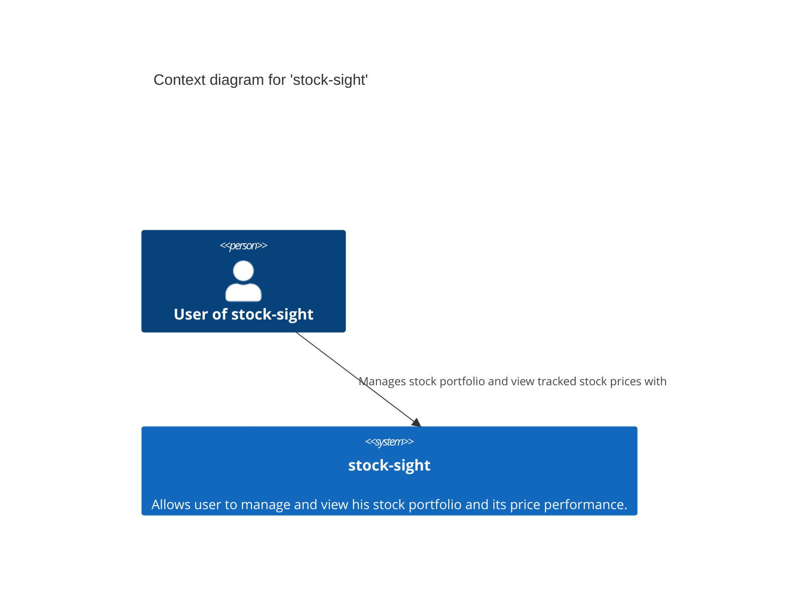
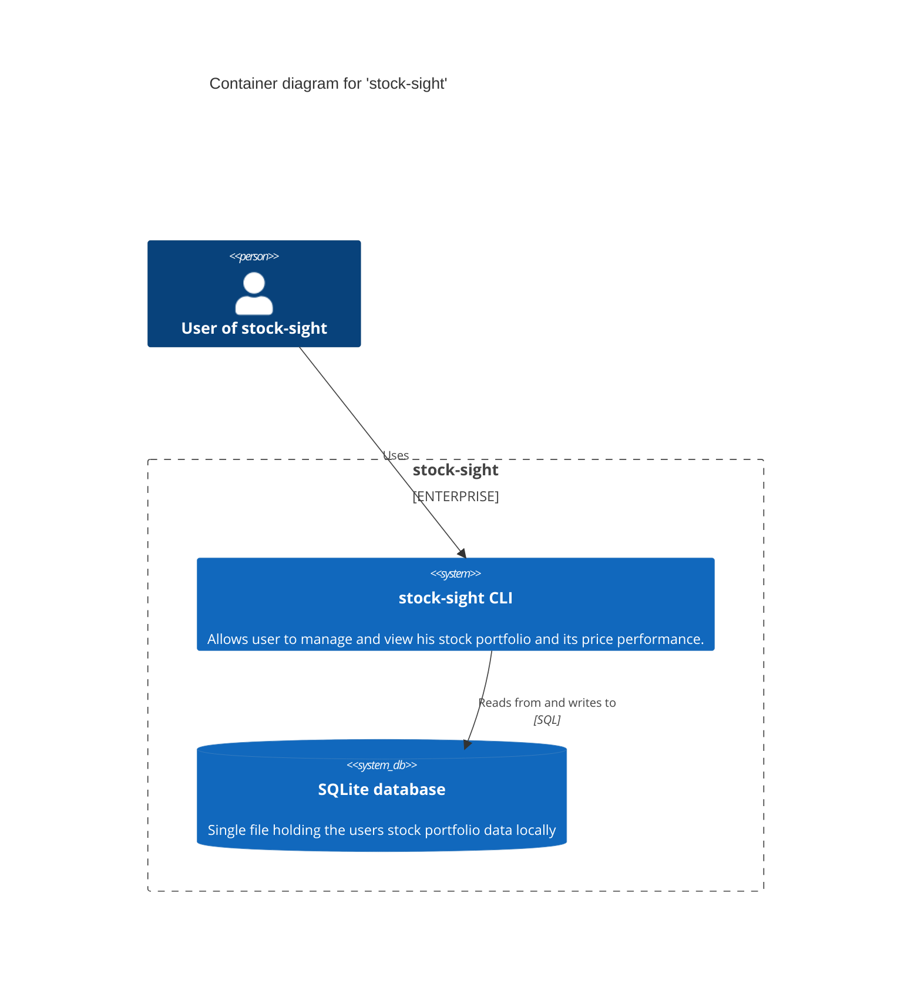
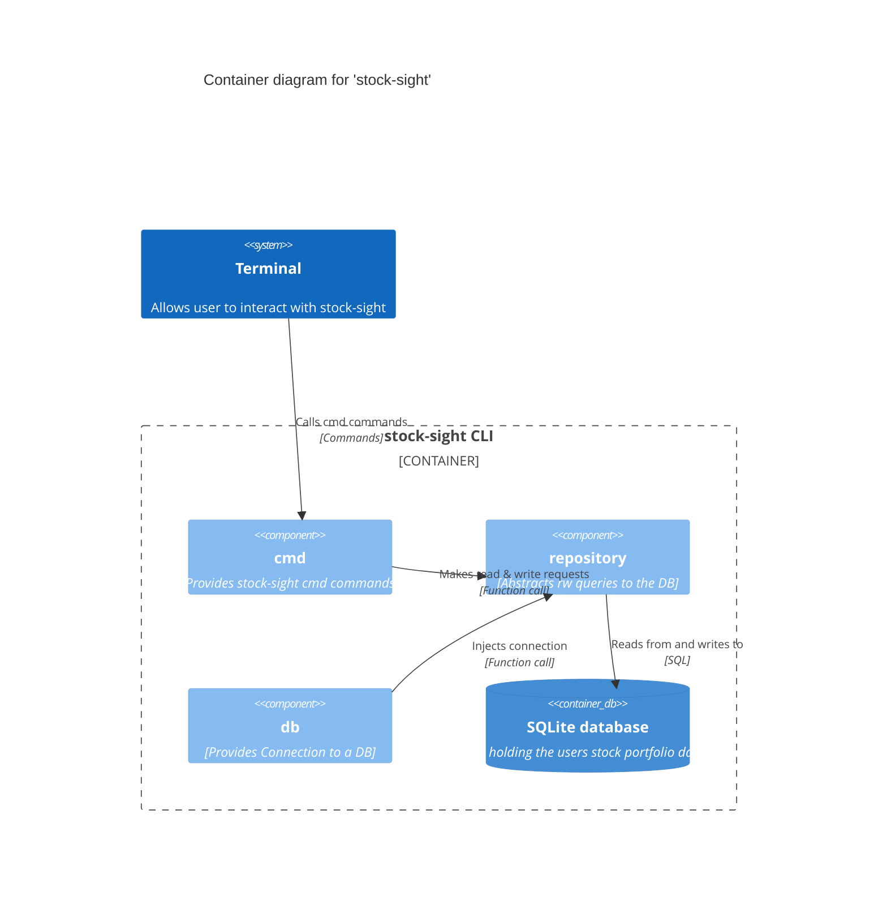
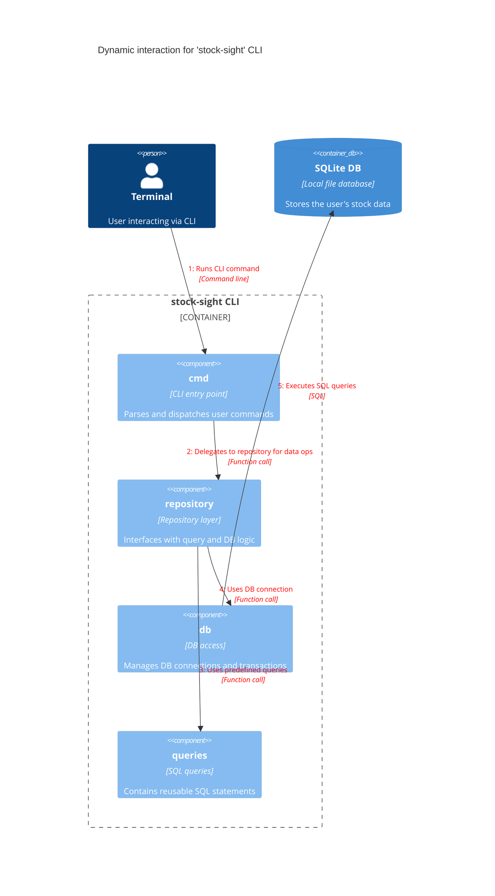

# C4 Model

## Context Diagram

```mermaid
C4Context
title Context diagram for 'stock-sight'

Person(customerA, "User of stock-sight")

System(systemA, "stock-sight", "Allows user to manage and view his stock portfolio and its price performance.")

Rel(customerA, systemA, "Manages stock portfolio and view tracked stock prices with")

UpdateLayoutConfig($c4ShapeInRow="1")
```

## Container Diagram

```mermaid
C4Container
title Container diagram for 'stock-sight'

Person(customerA, "User of stock-sight")

Enterprise_Boundary(b0, "stock-sight") {
  System(systemA, "stock-sight CLI", "Allows user to manage and view his stock portfolio and its price performance.")
  SystemDb(dbA, "SQLite database", "Single file holding the users stock portfolio data locally")
}

Rel(customerA, systemA, "Uses")
Rel(systemA, dbA, "Reads from and writes to", "SQL")

UpdateLayoutConfig($c4ShapeInRow="1", $c4BoundaryInRow="1")
```

## Component Diagram

```mermaid
C4Component
title Container diagram for 'stock-sight'

System(terminal, "Terminal", "Allows user to interact with stock-sight")

Container_Boundary(b0, "stock-sight CLI") {
  Component(componentA, "cmd", "Provides stock-sight cmd commands")
  Component(componentB, "repository", "Abstracts rw queries to the DB")
  Component(componentC, "db", "Provides Connection to a DB")
  ContainerDb(dbA, "SQLite database", "Single file holding the users stock portfolio data locally")

}

Rel(terminal, componentA, "Calls cmd commands", "Commands")
Rel(componentA, componentB, "Makes read & write requests", "Function call")
Rel(componentB, dbA, "Reads from and writes to", "SQL")
Rel(componentC, componentB, "Injects connection", "Function call")

UpdateLayoutConfig($c4ShapeInRow="2", $c4BoundaryInRow="1")
```

##  Dynamic Diagram

```mermaid
    C4Dynamic
    title Dynamic interaction for 'stock-sight' CLI

    Person(terminal, "Terminal", "User interacting via CLI")

    ContainerDb(sqlite, "SQLite DB", "Local file database", "Stores the user's stock data")

    Container_Boundary(b0, "stock-sight CLI") {
      Component(cmd, "cmd", "CLI entry point", "Parses and dispatches user commands")
      Component(repository, "repository", "Repository layer", "Interfaces with query and DB logic")
      Component(db, "db", "DB access", "Manages DB connections and transactions")
      Component(queries, "queries", "SQL queries", "Contains reusable SQL statements")
    }

    Rel(terminal, cmd, "Runs CLI command", "Command line")
    Rel(cmd, repository, "Delegates to repository for data ops", "Function call")
    Rel(repository, queries, "Uses predefined queries", "Function call")
    Rel(repository, db, "Uses DB connection", "Function call")
    Rel(db, sqlite, "Executes SQL queries", "SQL")

    UpdateRelStyle(terminal, cmd, $textColor="red", $offsetY="-40")
    UpdateRelStyle(cmd, repository, $textColor="red", $offsetX="-50")
    UpdateRelStyle(repository, queries, $textColor="red", $offsetY="50")
    UpdateRelStyle(repository, db, $textColor="red", $offsetY="20")
    UpdateRelStyle(db, sqlite, $textColor="red", $offsetY="-40")
```

