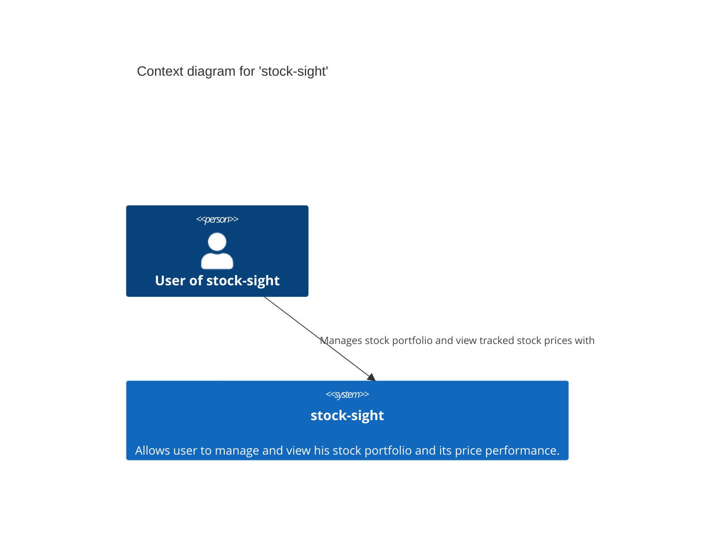
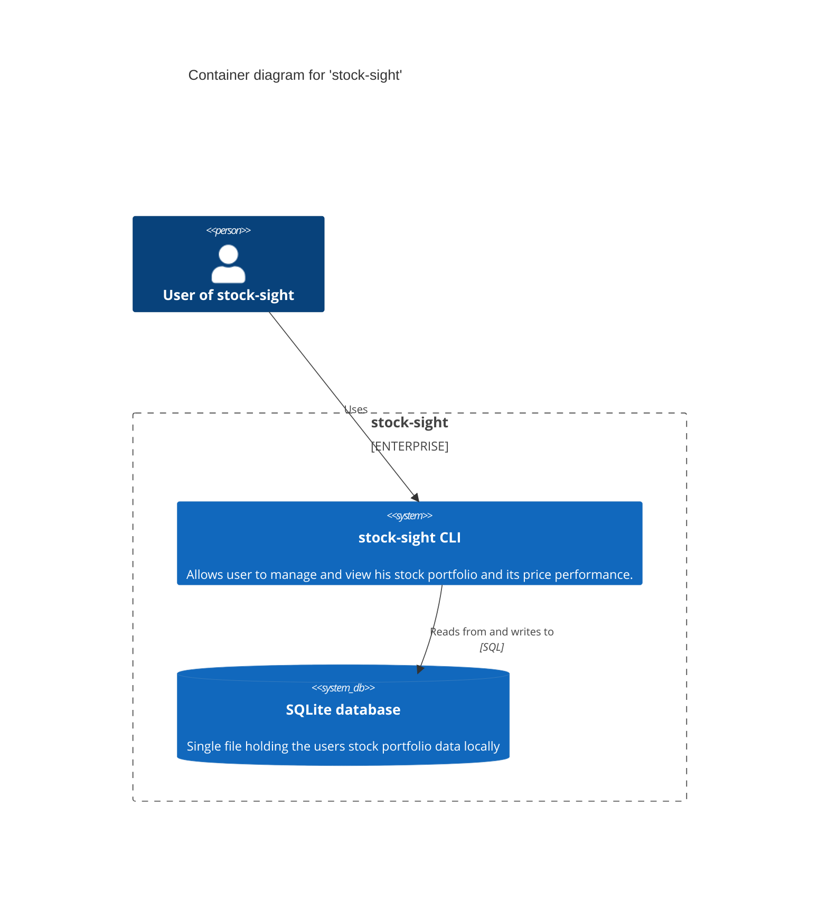
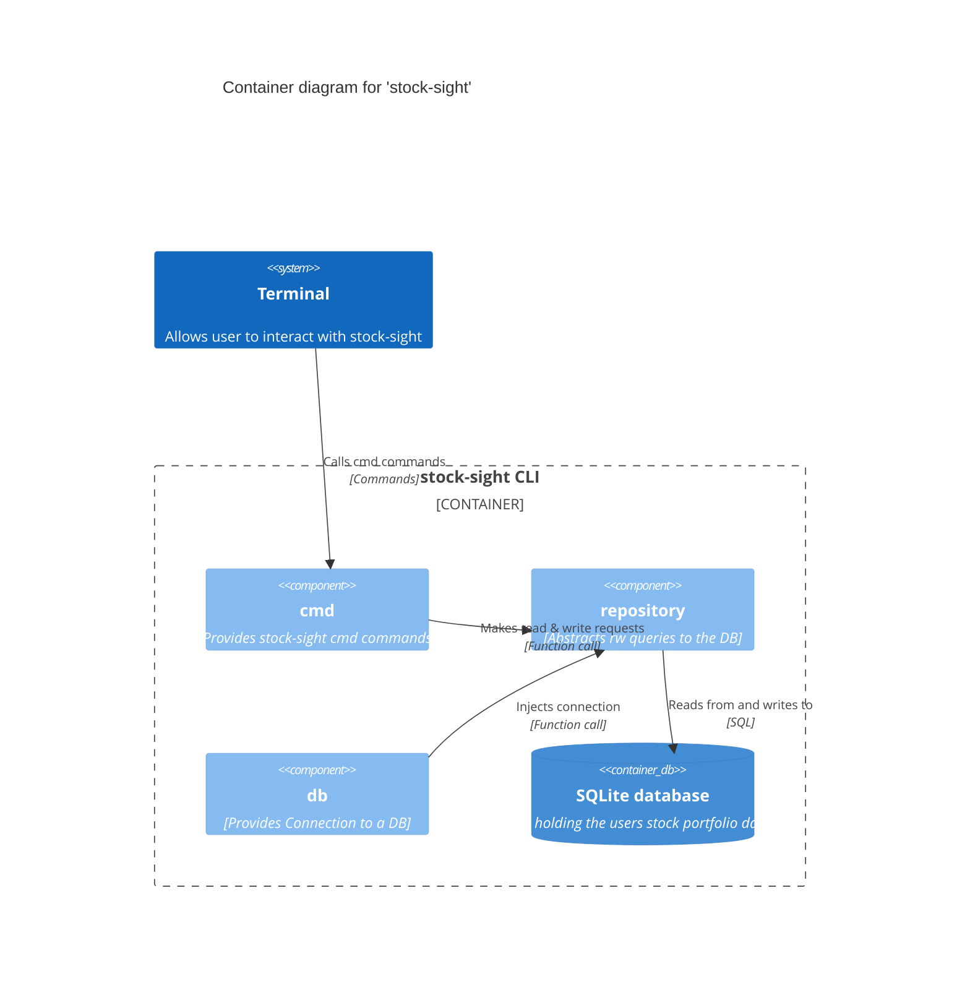

# C4 Model

## Context Diagram

```mermaid
C4Context
title Context diagram for 'stock-sight'

Person(customerA, "User of stock-sight")

System(systemA, "stock-sight", "Allows user to manage and view his stock portfolio and its price performance.")

Rel(customerA, systemA, "Manages stock portfolio and view tracked stock prices with")

UpdateLayoutConfig($c4ShapeInRow="1")
```

## Container Diagram

```mermaid
C4Container
title Container diagram for 'stock-sight'

Person(customerA, "User of stock-sight")

Enterprise_Boundary(b0, "stock-sight") {
  System(systemA, "stock-sight CLI", "Allows user to manage and view his stock portfolio and its price performance.")
  SystemDb(dbA, "SQLite database", "Single file holding the users stock portfolio data locally")
}

Rel(customerA, systemA, "Uses")
Rel(systemA, dbA, "Reads from and writes to", "SQL")

UpdateLayoutConfig($c4ShapeInRow="1", $c4BoundaryInRow="1")
```

## Component Diagram

```mermaid
C4Component
title Container diagram for 'stock-sight'

System(terminal, "Terminal", "Allows user to interact with stock-sight")

Container_Boundary(b0, "stock-sight CLI") {
  Component(componentA, "cmd", "Provides stock-sight cmd commands")
  Component(componentB, "repository", "Abstracts rw queries to the DB")
  Component(componentC, "db", "Provides Connection to a DB")
  ContainerDb(dbA, "SQLite database", "Single file holding the users stock portfolio data locally")

}

Rel(terminal, componentA, "Calls cmd commands", "Commands")
Rel(componentA, componentB, "Makes read & write requests", "Function call")
Rel(componentB, dbA, "Reads from and writes to", "SQL")
Rel(componentC, componentB, "Injects connection", "Function call")

UpdateLayoutConfig($c4ShapeInRow="2", $c4BoundaryInRow="1")
```

##  Code Diagram

> tbd
